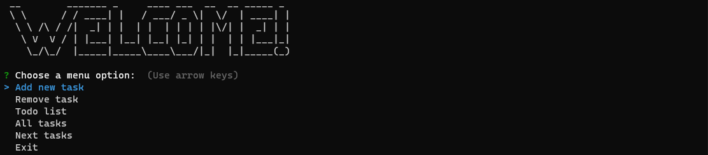
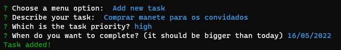
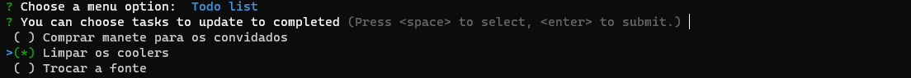
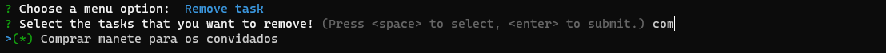
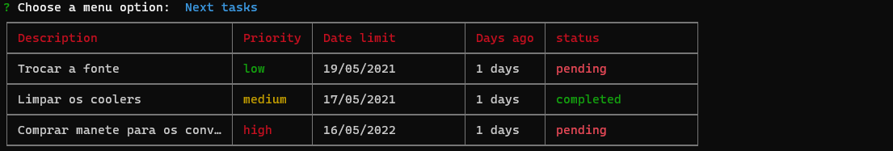
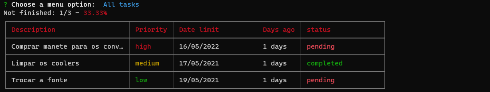

<p align="center">
  <h1>tasker cli</h1>
</p>

## Como usar?
Antes de tudo é necessário rodar ```yarn install``` para que o yarn instale todas as dependências necessárias do projeto (incluindo as tipagens do TS).
(Você pode optar também por npm install).

## Dependências / Tecnologias
  - Chalk
  - cli-table
  - figlet
  - inquirer
  - inquirer-date-prompt
  - inquirer-search-checkbox
  - reflect-metadata
  - sqlite3
  - typeorm
  - uuid

## Como usar

#### 1 - Welcome!
Antes de tudo, seja bem vindo ao tasker cli


#### 2 - Adicionando Tasks
Você pode adicionar uma nova tarefa através do menu "add new task", logo em seguida você deve responder algumas perguntas como, a descrição da tarefa
a prioridade e a data que pretende concluí-la.



#### 3 - Atualizando como concluída
Através do menu ""


#### 3 - Removendo tasks


#### 4 - Próximas tarefas


#### 5 - Listagem de tarefas

